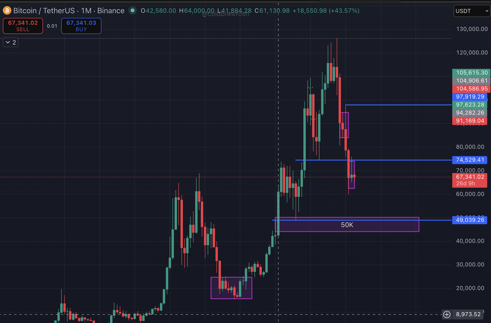
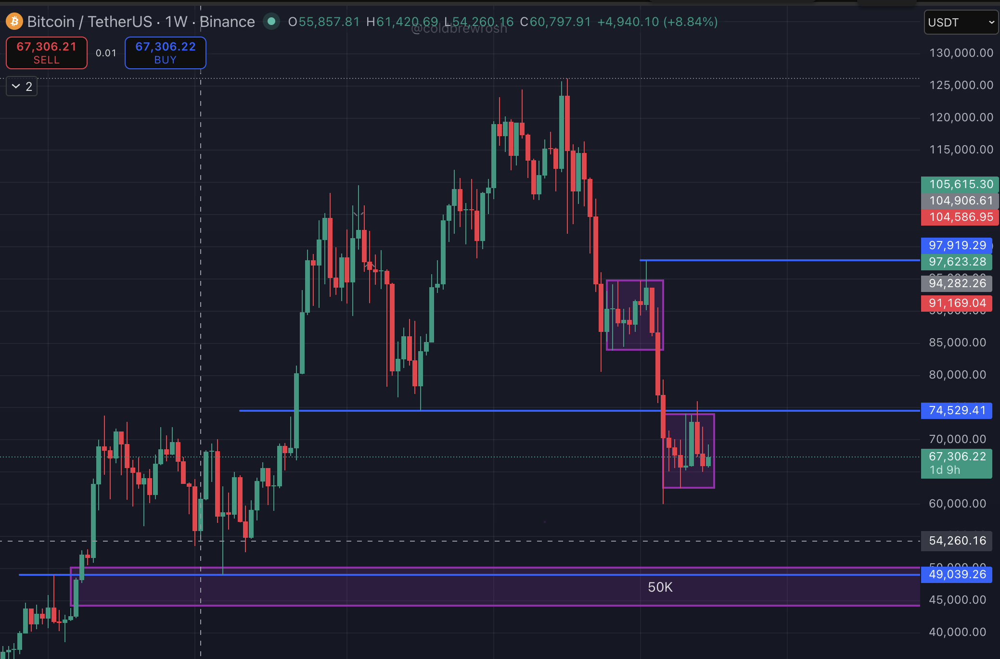
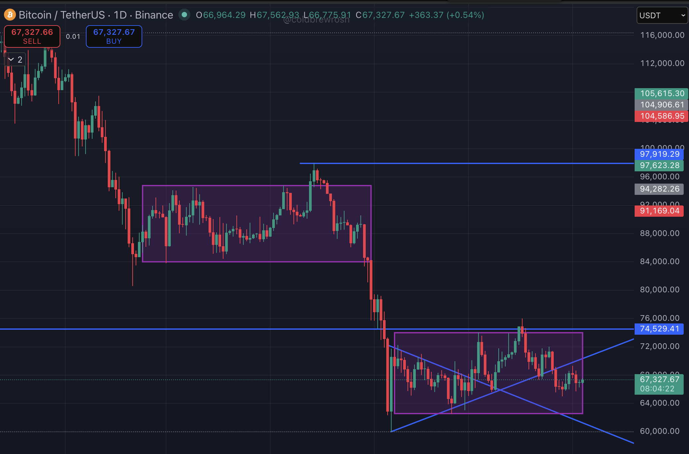

# Bitcoin Breakout Analysis

Date: 2026-04-04

# The $50K Gravity Pull: Why Bitcoin's Next Stop Might Be Lower Than You Think

**"The market doesn't forget. It just waits — and right now, it's waiting at $62,600."**

---

Let me paint you a picture.

You're watching a building on fire. The crowd is saying, _"Don't worry, the fire department is on the way."_ But the fire keeps spreading. Every time someone announces help is coming, the flames get a little quieter — then roar back louder.

That's Bitcoin right now.

Not dead. Not dying. But burning through the illusions that were built around it — and the chart is telling us exactly where the smoke is leading.

Let me break it down, timeframe by timeframe.

---

## The Monthly Chart: The Big Picture Doesn't Lie

Zoom out. All the way.

On the monthly chart, Bitcoin peaked somewhere above $108,000, formed a stunning top, and has since been rolling over in what is textbook bearish momentum. The next monthly support that matters — the level that has been acting as a gravitational pull — is right around **$50,000**.

This isn't just some arbitrary number. The $50K zone is a _confluence of confluences_:

- A major **monthly support level** from the previous cycle
- A **weekly Fair Value Gap (FVG)** that never fully got rebalanced
- The most sacred of all market forces — a **psychological round number**

When multiple technical structures align at one price, it's no longer just support. It becomes a **magnet**. And right now, price is moving toward it.

The question isn't _if_ Bitcoin tests $50K. The question is — _what needs to break first?_

## The Weekly Chart: The Break Has Already Happened

Here's what most people missed while they were watching the daily noise.

On the weekly timeframe, Bitcoin has **cleanly broken its weekly support level**. Not a wick. Not an ambiguous close. A clean, decisive break — followed by a textbook retest of that same level, which now acts as resistance. That's the classic _support becoming resistance_ flip that traders spend years learning to recognize.

The weekly structure is now oriented downward. The previous support flipped to resistance has capped any meaningful rally attempt. As long as price stays below that level, the bias is lower.

This matters because the **weekly timeframe is where institutional hands move**. Retail traders fight over 15-minute candles. The smart money is playing the weekly. And the weekly is telling us: the next destination is $50K — pending one more domino falling.

## The Daily Chart: The Last Domino Is at $62,600

Now we get granular.

This is where it gets genuinely fascinating — and where the story of the _current consolidation_ becomes critical.

On **February 7, 2026**, Bitcoin entered a consolidation range. Weeks of sideways chop, building what looked to many like a base for another leg up. Bulls were hopeful. The narrative was strong. Then came **March 17, 2026** — the day price swept the _liquidity_ sitting below that entire consolidation zone.

That wasn't an accident. That was the algorithm doing what it always does: hunting the stops of the traders who'd been holding the range low. Once that liquidity was taken, the consolidation lost its foundation. And now we're watching price struggle against an _internal daily support level_ — one that is simultaneously acting as the last line of defense before the real damage begins.

Here's the sequence of events playing out in slow motion:

**The consolidation support — $62,600 — is the final gate.**

If Bitcoin loses that level on a daily close, there's a story in the chart that looks very similar to what happened during the last major consolidation. From **November 24, 2025 to January 14, 2026**, Bitcoin chopped sideways, then broke down from $80K all the way to $60K. That consolidation took its liquidity. Then the real move began.

History doesn't repeat. But on a chart? It rhymes with stunning regularity.

Currently, we're watching price attempt to hold an internal daily level while simultaneously retesting the _previous support that has now flipped to resistance_ — a structure that traders who understand smart money concepts will recognize instantly. The market is giving multiple signals, all pointing in the same direction.

## The Geopolitical Backdrop: When the Hype Machine Stalls

Now let's talk about something most technical analysts conveniently ignore — the _narrative layer_ that was supposed to fuel Bitcoin's next bull run.

Earlier this year, Bitcoin was going to be **digital gold**. It was going to surge while stocks crashed. It was going to be the hedge that every institution, government, and central bank would rush to hold. The logic seemed airtight.

It wasn't.

In March 2025, President Trump signed an executive order establishing a **Strategic Bitcoin Reserve** — and the market crashed immediately afterward. Why? Because traders had been expecting the government to _buy_ Bitcoin on the open market. Instead, the reserve would only contain **seized and forfeited Bitcoin** — no new purchases, no fresh capital injection, no bullish demand shock. As one analyst described it at the time: the BTC reserve was funded with existing government holdings, "rather than new purchases that would have greatly increased demand."

That disappointment planted a seed of doubt.

Fast forward to today — **a full year after that executive order — and the Strategic Bitcoin Reserve still doesn't functionally exist**. Congressional action is required before it can be formalized, and that legislation has been caught in the gridlock of competing priorities. Trump's administration reportedly needs a late-year defense bill as a vehicle to advance the reserve legislation — hardly the "crypto capital of the world" momentum the market had priced in.

The market bet big on a specific catalyst. The catalyst didn't deliver. And now that bet is unwinding.

Meanwhile, the **US-Iran geopolitical tension** has introduced another layer of macro uncertainty. Bitcoin, which was supposed to surge during global fear events the way gold does, instead fell roughly 2% alongside equities when Trump renewed aggressive posturing toward Iran. BlackRock's own head of digital asset strategy admitted confusion about this publicly: he couldn't understand why tariffs and geopolitical tension were pushing Bitcoin _down_ instead of up, since those macro forces shouldn't theoretically impact a decentralized asset.

That confusion is the story. Bitcoin is behaving like a risk asset — not a hedge. When fear rises, it sells off with tech stocks. When markets recover, it lags. The correlation between Bitcoin and gold turned _negative_ in early 2026. For an asset marketed as "digital gold," that's a structural identity crisis.

---

## The Consolidation Illusion: Optimism That Couldn't Sustain

There's been a persistent bull narrative: _Bitcoin will benefit from the US stock market bear run_. When equities crash, money will flow into BTC.

It's a beautiful theory. The chart disagrees.

During the recent equity sell-off, Bitcoin didn't catch flows. It participated in the panic. The old crypto-equity decoupling story — beloved by every crypto Twitter influencer — simply hasn't materialized. Instead, overleveraged positions got liquidated, ETF outflows accelerated the selling pressure, and what started as a healthy pullback morphed into something structurally concerning.

The current consolidation between the mid-$60Ks and the $74K resistance zone isn't building a base for a new bull run. It looks — on every timeframe — like **distribution**. Smart money offering supply to optimistic retail buyers who are still holding onto the ATH narrative.

And when distribution ends, price delivers.

---

## The Road Map: What Happens Next

Let me be direct about the scenario I'm tracking.

**Scenario 1 — Consolidation breaks down:**
Price loses the current internal daily support, then breaks below **$62,600** (the consolidation floor). Once that happens, the weekly FVG and monthly support at **$50,000** become the next logical destination — and given the velocity that typically follows a major support break, the move could be swift.

**Scenario 2 — Consolidation holds:**
Price reclaims the $74,529 resistance level and flips it to support. This would invalidate the bearish structure on the daily and signal a possible recovery leg toward the $91K–$97K cluster. But for this to happen, Bitcoin needs a genuine catalyst — not a rumor, not a headline, but actual institutional demand.

Right now, Scenario 1 has the weight of evidence behind it. Three timeframes aligned. Macro uncertainty increasing. Government catalyst delayed indefinitely. Leverage unwound but sentiment fragile. The "negative gamma" zone in options markets means that if Bitcoin sustains a break below $68K, dealers may be forced to sell more BTC as prices fall — creating a self-reinforcing wave downward.

---

## The $50K Confluence: Why It Matters

When price reaches the $50K zone, this is what converges:

- **Monthly support** — the structural floor of the previous bull cycle
- **Weekly Fair Value Gap** — an untouched inefficiency the algorithm needs to rebalance
- **Psychological round number** — the kind of level where retail capitulation peaks and smart money begins accumulating

If you're a long-term Bitcoin believer, $50K is not the end of the world. It may actually be the gift. The conditions that typically precede the _next_ explosive bull run — genuine fear, maximum pessimism, retail capitulation, smart money quietly loading — those conditions tend to emerge at exactly these kinds of confluences.

But you have to understand the structure to recognize the opportunity when it appears.

---

## Final Thought: The Market Is Still Hunting You

Every time Bitcoin has convinced the retail crowd to hold, to stay optimistic, to buy the dip — it has found a way to make those holders uncomfortable one more time before reversing.

That's not cynicism. That's the game.

The same smart money mechanics we discussed in liquidity and fair value gaps apply here on a macro level. The market built a liquidity pool at the consolidation lows. It swept them on March 17. It is now engineering the psychology of hope — a small bounce, a few green days, _maybe it's over_ — before the next sweep.

Maybe it is over. Maybe $67K holds, and Bitcoin surprises everyone.

But the charts, the macro, and the policy narrative are all singing the same song right now.

And that song sounds like gravity.

**Watch $62,600. Everything below that is a different conversation.**

---

_Trade safe. Manage risk. The market doesn't owe anyone a bull run — but it always rewards those who read the structure._

---

_If this resonated with you, share it with a trader who's still watching the daily chart and missing the bigger story. The best analysis isn't about predictions — it's about reading what the market is already telling you._
